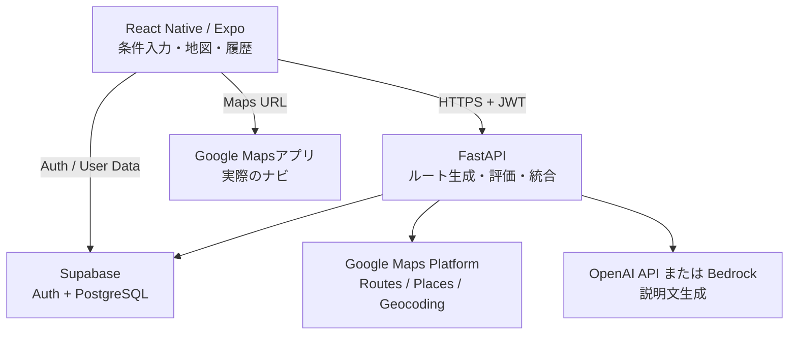
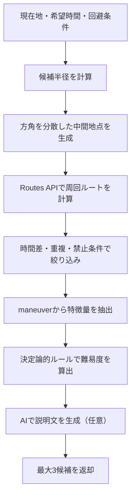

# 04｜システム構成・処理フロー

## 全体構成

## 責務

### モバイルアプリ

- 位置情報権限の説明と現在地取得
- 条件入力、地図、候補カードの表示
- 認証状態とユーザー操作の管理
- Google MapsへのDeep Link
- 外部ナビから戻った際の進行中セッション復元

### FastAPI

- 入力値とJWTの検証
- 候補地点の生成
- Google Maps Platformとの連携
- ルート特徴量の抽出と難易度スコアリング
- AIによる説明生成とフォールバック
- 保存、履歴APIの認可

### Supabase

- ユーザー認証
- PostgreSQLによるデータ保存
- Row Level Securityによるユーザー別データ保護

### 外部サービス

- Google Maps Platform：地理的事実、経路、距離、所要時間
- OpenAI API / Bedrock：渡された特徴量の説明のみ
- Google Mapsアプリ：実際のターンバイターンナビ

## ルート生成フロー

## 障害時の扱い

| 状況 | 対応 |
| --- | --- |
| 位置情報拒否 | 住所または施設名の手入力へ切り替える |
| ルート候補不足 | 希望時間の許容幅や回避条件の緩和を提案する |
| Google API失敗 | 入力を保持し、再試行可能なエラーを表示する |
| AI失敗 | 特徴量から生成するテンプレート説明へフォールバックする |
| DB保存失敗 | ルート表示は維持し、保存操作のみ再試行する |

## 境界上の原則

- モバイルアプリに外部サービスの秘密鍵を置かない
- 外部APIのレスポンスを信用せず、バックエンドで正規化・検証する
- 難易度算出と説明生成を分離する
- ルート生成に失敗しても、ユーザーの入力条件を失わない

## 関連資料

- [DB設計](05_DB設計.md)
- [API設計](06_API設計.md)
