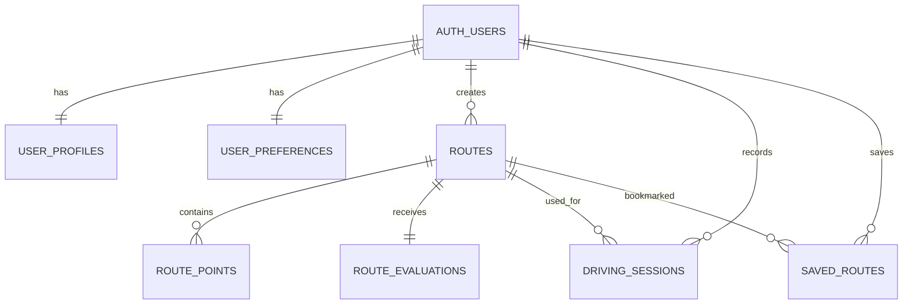

# 05｜DB設計

## 設計方針

Supabase AuthのユーザーIDを基点に、設定、ルート、評価、走行履歴を分離します。MVPでは道路セグメントや交差点の独自マスタを持ちません。

## テーブル

### `user_profiles`

| カラム | 型・制約 |
| --- | --- |
| `user_id` | `uuid` PK / FK → `auth.users.id` |
| `display_name` | `text` |
| `created_at` | `timestamptz` |
| `updated_at` | `timestamptz` |

### `user_preferences`

| カラム | 型・制約 |
| --- | --- |
| `user_id` | `uuid` PK / FK → `auth.users.id` |
| `default_duration_minutes` | `int` |
| `avoid_highways` | `boolean` |
| `avoid_tolls` | `boolean` |
| `avoid_ferries` | `boolean` |
| `created_at` | `timestamptz` |
| `updated_at` | `timestamptz` |

### `routes`

| カラム | 型・制約 |
| --- | --- |
| `id` | `uuid` PK |
| `owner_user_id` | `uuid` nullable FK |
| `origin_lat` | `double precision` |
| `origin_lng` | `double precision` |
| `target_duration_minutes` | `int` |
| `duration_seconds` | `int` |
| `distance_meters` | `int` |
| `encoded_polyline` | `text` |
| `google_route_token` | `text` nullable |
| `status` | `text` |
| `created_at` | `timestamptz` |

### `route_points`

| カラム | 型・制約 |
| --- | --- |
| `id` | `uuid` PK |
| `route_id` | `uuid` FK |
| `point_type` | `text`（`origin` / `waypoint` / `destination`） |
| `sequence_no` | `int` |
| `latitude` | `double precision` |
| `longitude` | `double precision` |
| `place_id` | `text` nullable |
| `label` | `text` nullable |

### `route_evaluations`

| カラム | 型・制約 |
| --- | --- |
| `id` | `uuid` PK |
| `route_id` | `uuid` FK |
| `scoring_version` | `text` |
| `difficulty_level` | `smallint` |
| `right_turn_count` | `int` |
| `left_turn_count` | `int` |
| `maneuver_count` | `int` |
| `uses_highway` | `boolean` |
| `uses_toll_road` | `boolean` |
| `duration_minutes` | `int` |
| `distance_meters` | `int` |
| `evaluation_reason` | `text` |
| `caution_points` | `jsonb` |
| `created_at` | `timestamptz` |

### `driving_sessions`

| カラム | 型・制約 |
| --- | --- |
| `id` | `uuid` PK |
| `user_id` | `uuid` FK |
| `route_id` | `uuid` nullable FK |
| `started_at` | `timestamptz` |
| `ended_at` | `timestamptz` nullable |
| `actual_duration_seconds` | `int` nullable |
| `status` | `text` |
| `self_rating` | `smallint` nullable |
| `memo` | `text` nullable |

### `saved_routes`

| カラム | 型・制約 |
| --- | --- |
| `user_id` | `uuid` FK |
| `route_id` | `uuid` FK |
| `saved_at` | `timestamptz` |

主キーは`user_id, route_id`の複合主キーとします。

## リレーション

## インデックス候補

- `routes(owner_user_id, created_at desc)`
- `route_points(route_id, sequence_no)`
- `driving_sessions(user_id, started_at desc)`
- `saved_routes(user_id, saved_at desc)`

## RLS方針

- 自分のプロフィール、設定、履歴、保存データのみ読み書き可能とする
- `routes`は`owner_user_id`が本人の場合のみ変更可能とする
- サービスロールはバックエンド内に限定する
- RLSのテストで他ユーザーのデータを読み書きできないことを検証する

## 将来追加候補

- `road_feedback`
- `road_segments`
- `intersection_feedback`

独自データを収集・更新する運用上の必要性が確認できるまで導入しません。

## 未決事項

- 各`status`カラムの列挙値とDB制約
- ルートデータの保存期間と削除方針
- 匿名状態で生成したルートをサインイン後に引き継ぐか
- Google由来データの保存可否と保持期間に関する規約確認
