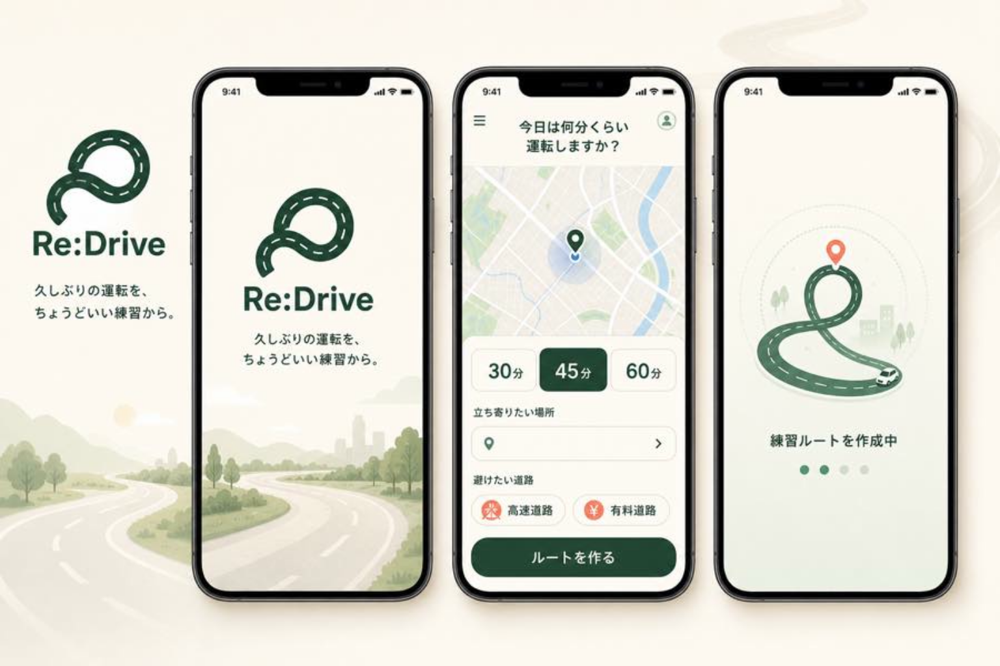
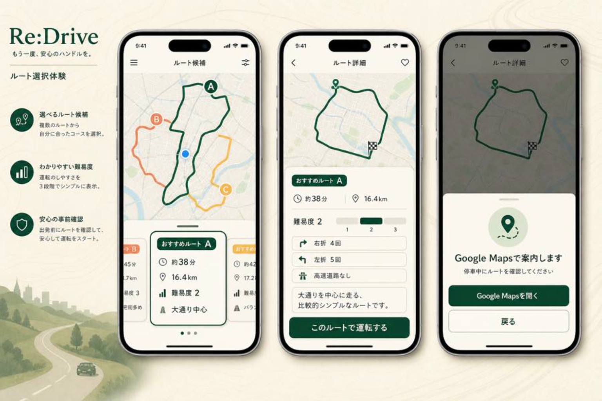
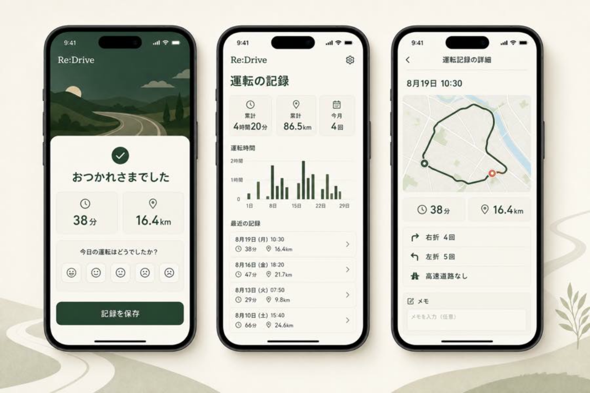
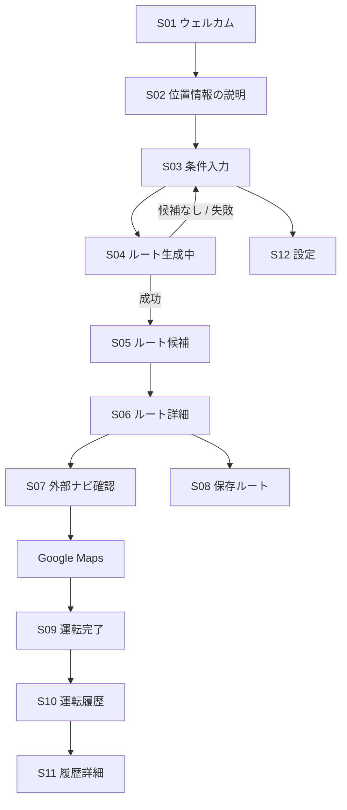

# 09｜画面設計・UI・UX

## デザインコンセプト

**Calm Confidence — 不安を煽らず、必要な情報と次の操作を静かに示す。**

- 深いグリーン：安心感、落ち着き、主要アクション
- ウォームクリーム：緊張感を避ける背景
- セージ / ミント：選択状態や補助情報
- コーラル：注意とルート識別に限定
- 候補選択では「時間 → ルート難易度 → 理由 → 行動」の順で見せる
- 履歴では成長判定を行わず、時間、距離、ルートの事実を中心に見せる
- 運転中ではなく、必ず停車中の操作を前提にする

## 画面モック

以下の画像は方向性を確認するためのコンセプトモックです。実装時は地図SDK、OS標準コンポーネント、実データに合わせて調整します。

### 画面イメージ1｜開始・条件入力

### 画面イメージ2｜候補比較・詳細・外部ナビ

### 画面イメージ3｜運転完了・履歴

## 主要画面

| ID | 画面 | MVP | 主目的 |
| --- | --- | --- | --- |
| S01 | ウェルカム | 必須 | 価値提案と開始 |
| S02 | 権限説明 | 必須 | 位置情報の目的を説明 |
| S03 | 条件入力 | 必須 | 時間、地点、回避条件の設定 |
| S04 | ルート生成中 | 必須 | 進捗、待機、失敗時の回復 |
| S05 | ルート候補 | 必須 | 最大3案の比較 |
| S06 | ルート詳細 | 必須 | 根拠を見て選択 |
| S07 | 外部ナビ確認 | 必須 | 停車確認とGoogle Maps遷移 |
| S08 | 保存ルート | 必須 | 候補の再利用 |
| S09 | 運転完了 | 必須 | 時間、距離、任意の感想を記録 |
| S10 | 運転履歴 | 必須 | 累計と過去の走行を確認 |
| S11 | 履歴詳細 | 必須 | 個別の走行記録を確認 |
| S12 | プロフィール・設定 | 必須 | 既定条件とデータ管理 |

## 主要フロー

## 条件入力

- 地図上に現在地を明確に表示する
- 30分、45分、60分をワンタップで選択できるようにする
- カスタム時間は次段階とする
- 「避けたい道路」の選択状態を色だけで表現しない
- 位置情報が使えない場合は住所や施設名入力へ切り替える
- 生成中もキャンセルまたは戻る手段を残す

## 候補比較とルート詳細

### 表示優先順位

1. 所要時間と希望時間との差
2. ルートの練習難易度（1〜5）
3. 右左折、操作回数、高速道路、有料道路の有無
4. 評価理由と注意ポイント
5. 保存、外部ナビ開始

### 候補カード

- A / B / Cを地図上のPolyline色と一致させる
- 選択中カードを枠線、ラベル、サイズ差で明示する
- 難易度はユーザーの能力ではなく、ルートに含まれる操作の複雑さを表す
- 「大通り中心」「右折4回」など、事実ベースの理由を表示する

## Google Mapsへの引き渡し

- ボタン押下後に確認シートを表示する
- 「停車中にルートを確認してください」を表示する
- Google Mapsでのナビ開始操作はユーザーに委ねる
- Google Mapsが未インストールの場合はブラウザ版へフォールバックする

## 運転完了と履歴

- 中心指標は運転時間、走行距離、運転回数とする
- レベル、達成バッジ、連続日数、次の課題は設けない
- 自己評価とメモは任意とし、未入力でも記録できる
- グラフは成績ではなく、いつどれくらい運転したかの確認に使う
- ルート難易度とユーザーの能力を結びつけない
- 「安全運転できた」とアプリが判定しない

## ナビゲーション

### MVPのボトムタブ

- **ホーム**：条件入力と新しいルート生成
- **保存**：保存済みルート
- **記録**：累計時間、距離、運転履歴
- **マイページ**：既定条件、位置情報、アカウント、データ削除

### 画面遷移ルール

- 条件入力内容は候補一覧から戻っても保持する
- 候補一覧と詳細で同じ選択状態を共有する
- 外部ナビ後にアプリへ戻った場合は進行中セッションを復元する
- 重大な変更や外部遷移はボトムシートで確認する

## 状態設計

### Loading

- 何を処理しているか短く表示する
- 10秒以上かかる場合は再試行または条件変更を提示する

### Empty

- 保存ルートなし：新しいルートの作成へ案内する
- 履歴なし：記録の仕組みを説明し、ホームへ案内する

### Error

- 位置情報拒否：地点入力を提示する
- 候補不足：希望時間や回避条件の変更候補を提示する
- 通信失敗：入力を保持したまま再試行できるようにする
- AI説明失敗：テンプレート説明へ切り替える

### Offline

- 保存済みルートと履歴は閲覧可能にする
- 新規ルート生成にはオンライン接続が必要と明示する

## コンポーネント候補

- `PrimaryButton`：画面内の主要行動は1つ
- `DurationSegment`：30分、45分、60分
- `AvoidanceChip`：アイコン、文言、選択マーク
- `RouteCard`：時間、距離、難易度、特徴
- `DifficultyMeter`：ルートの複雑さを数値と段階で表示
- `RouteFeatureRow`：右折、左折、高速道路、有料道路
- `SafetyCallout`：停車中の操作と免責
- `OptionalFeelingScale`：任意の5段階感想
- `HistorySummaryCard`：累計時間、距離、回数
- `HistoryRow`：日付、時間、距離
- `HistoryDetailMap`：実走または選択ルートの確認

## デザイントークン案

| 用途 | 値 |
| --- | --- |
| Primary | `#174C3A` |
| Primary pressed | `#10372A` |
| Secondary / Sage | `#9BB792` |
| Background | `#FAF7EF` |
| Surface | `#FFFFFF` |
| Text primary | `#183029` |
| Text secondary | `#607069` |
| Accent / Caution | `#EA7657` |
| Route B | `#E58A5B` |
| Route C | `#E1B34C` |
| Corner radius | `12 / 16 / 24` |
| Spacing | `4 / 8 / 12 / 16 / 24 / 32` |

## アクセシビリティ

- タップ領域は最低44×44pt相当とする
- 本文は16px相当を基本とし、Dynamic Typeや文字拡大を考慮する
- 色だけで選択、難易度、ルートを区別しない
- 地図上のA / B / Cラベルとカード名を一致させる
- 読み上げ順を画面タイトル、要点、詳細、操作の順にする
- アニメーション軽減設定では生成中の動きを静的表示へ変更する
- 高コントラストと屋外での視認性を実機確認する

## 文言ガイド

### 推奨

- 「練習難易度 2」
- 「大通り中心・右折4回」
- 「累計4時間20分・86.5km」
- 「停車中にルートを確認してください」

### 使用しない

- 「あなたの運転レベル」
- 「次のレベルまで」
- 「絶対に安全」
- 「事故が起きないルート」
- 「初心者でも必ず走れる」
- 不安を煽る警告や競争を促す表現

## 実装・検証順

1. S03 条件入力
2. S05 候補一覧
3. S06 ルート詳細
4. S07 外部ナビ確認
5. S04 Loading / Error
6. S08 保存、S09 完了、S10 履歴、S11 履歴詳細

## ユーザビリティテスト観点

- 初見で「何のアプリか」を10秒以内に説明できるか
- 30分コースを3タップ程度で生成できるか
- 候補A / B / Cの違いを理解できるか
- ルート難易度が本人の能力評価ではないと分かるか
- Google Mapsへ移ることを事前に理解できるか
- 履歴から日付、時間、距離を迷わず確認できるか
- 運転中にRe:Driveを操作する必要がないと伝わるか
